------------------------------------------------------------------------

Lab Objectives:
---------------

-   Sampling from data
-   Bootstrapping your data
-   Deriving statistical comparisons using bootstrapping

------------------------------------------------------------------------

Introduction to Bootstrapping
=============================

Bootstrapping can be a very useful tool in statistics and it is very easily implemented in R. Bootstrapping comes in handy when there is doubt that the usual distributional assumptions and asymptotic results are valid and accurate. Bootstrapping is a nonparametric method which lets us compute estimated standard errors, confidence intervals and hypothesis testing.

The term 'bootstrapping' originates from the expression "to pick yourself up by your own bootstraps", Imagine yourself stuck in the mud, lifting yourself up and out without external inputs and assistance. Seems like magic, right?


Generally bootstrapping follows the same basic steps:

-   Resample a given data set a specified number of times
-   Calculate a specific statistic from each sample
-   Find the standard deviation (or other measure of interest) of the distribution of that statistic

The sample function
-------------------

A major component of bootstrapping is being able to resample a given data set, and in R the function which does this is the **sample()** function.

We'll demonstrate this with a simple analogy of a bag containing 70 marbles of different colours (15 red, 30 blue, 20 green, and 5 white):

``` r
reds<-rep("red", 15)
blues<-rep("blue", 30)
greens<-rep("green", 20)
whites<-rep("white", 5)
marbles<-c(reds, blues, greens, whites)
marbles
```

    ##  [1] "red"   "red"   "red"   "red"   "red"   "red"   "red"   "red"  
    ##  [9] "red"   "red"   "red"   "red"   "red"   "red"   "red"   "blue" 
    ## [17] "blue"  "blue"  "blue"  "blue"  "blue"  "blue"  "blue"  "blue" 
    ## [25] "blue"  "blue"  "blue"  "blue"  "blue"  "blue"  "blue"  "blue" 
    ## [33] "blue"  "blue"  "blue"  "blue"  "blue"  "blue"  "blue"  "blue" 
    ## [41] "blue"  "blue"  "blue"  "blue"  "blue"  "green" "green" "green"
    ## [49] "green" "green" "green" "green" "green" "green" "green" "green"
    ## [57] "green" "green" "green" "green" "green" "green" "green" "green"
    ## [65] "green" "white" "white" "white" "white" "white"

``` r
table(marbles)
```

    ## marbles
    ##  blue green   red white 
    ##    30    20    15     5

``` r
table(marbles)/5
```

    ## marbles
    ##  blue green   red white 
    ##     6     4     3     1

So, the bag of marbles has a ratio of 6:4:3:1 of blue:green:red:white.

Now sample 10 marbles, at random, but with replacement, and use the **table()** function to count the colours from the drawn marbles.

Note: Due to differences in the random seed, your results might differ from the results shown below! We can use the **set.seed()** function to ensure our example yields similar results.

``` r
set.seed(1234)
draw<-sample(marbles, size=10)
table(draw)
```

    ## draw
    ##  blue green   red white 
    ##     3     2     3     2

``` r
draw<-sample(marbles, size=10)
table(draw)
```

    ## draw
    ##  blue green   red white 
    ##     4     3     2     1

``` r
draw<-sample(marbles, size=10)
table(draw)
```

    ## draw
    ##  blue green   red white 
    ##     3     3     3     1

Each draw produces a slightly different breakdown of colours, but generally, blue &gt; green &gt; red &gt; white. If this was done enough times and the results summarised, the ratio would converge to the known ratio. Of course you could just dump them all out and count them, but that's not bootstrapping!

<br>

------------------------------------------------------------------------

So, moving away from marbles and back to numbers. How does the **sample()** function work with data?

``` r
x<-1:100
sample(x, size=10, replace=TRUE, prob=NULL)
```

    ##  [1]  46  27  31  51  19  76  21  26 100  81

The first argument is a vector containing the data set to be resampled (in this case, the variable, x). The size option specifies the sample size with the default being the size of the population being resampled. The replace option determines if the sample will be drawn with or without replacement where the default value is FALSE, i.e. without replacement. The prob option takes a vector of length equal to the data set given in the first argument containing the probability of selection for each element of x. The default value (set prob=NULL) is for a random sample where each element has equal probability of being sampled. For our applications, we won't likely be adjusting the probability of drawing a particular number, so set prob=NULL.

In a typical bootstrapping situation we would want to obtain bootstrapping samples of the same size as the population being sampled and we would want to sample with replacement. Since we draw at random, this does not mean each sample is identical to the data. Indeed, replacement means you might sample that number again at random. We are merely using the data as the source of information about the distribution, in the absence of any theoretical framework.

Using **sample()** to generate a permutation of the sequence 1:10:

``` r
sample(x=1:10, size=10, replace=T)
```

    ##  [1] 6 7 4 7 4 6 7 5 3 8

Bootstrap another sample from the same sequence:

``` r
sample(x=10, size=10, replace=T)
```

    ##  [1] 1 4 8 6 2 6 5 8 2 9

------------------------------------------------------------------------

Exercise 1: A bootstrap example with fake data
----------------------------------------------

In the following bootstrapping example we would like to obtain a standard error for the estimate of the median. We will be using the **lapply()** and **sapply()** functions in combination with the **sample()** function. For more information about the lapply and sapply function please look at the advanced function R library pages or consult the help manuals (?lapply, ?sapply).

### Calculating the standard error of the median

First, we create a fake data set by taking 100 observations from a normal distribution with mean 5 and stdev 3, but we have rounded each observation to nearest integer:

``` r
data <- round(rnorm(n=100, mean=5, sd=3))
data[1:10] # the first 10 data points
```

    ##  [1]  8  4  3  3  0  1 -2  1  4  4

Now, let's obtain 1000 bootstrap samples, but just display the first of the bootstrap samples:

``` r
resamples <- lapply(1:1000, function(i) sample(data, size=100, replace = TRUE))
resamples[1]
```

    ## [[1]]
    ##   [1]  5  3  1 10  2  9  3  4  0  3 10  6  9  5  3  4  2  8 10  5  2  4  3
    ##  [24]  6  3 10  5 10 11  2  6  4  5  5  5  6 11  2  8  7 10  3  4 11 10  5
    ##  [47]  4  6  8  2  3  8  5  5  2  4  4  5  5  8  4  1  6  2  3  2  4  3  6
    ##  [70] 11  3  7  5  4  3  9  9  3 11  4  5  3  4  0  2 13  3  2 11  0  0  3
    ##  [93]  4  6  6 10  1  3  6  2

resamples\[1\] displays a list of the first bootstrapped sample from the data.

Now we calculate the median for each bootstrap sample, using **sapply()** which applies the median to each of our 1000 bootstraps, leading to 1000 median values (we'll just display the first 20 here):

``` r
r.median <- sapply(resamples, median)
r.median[1:20]
```

    ##  [1] 4.5 4.0 4.0 5.0 4.0 5.0 4.0 4.0 4.0 4.5 5.0 5.0 4.0 4.0 4.0 4.0 4.0
    ## [18] 4.0 4.0 5.0

What does the distribution of medians look like?

``` r
hist(r.median, breaks=10)
```

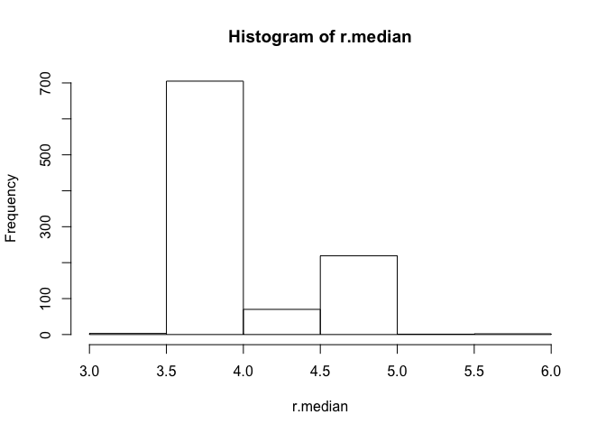

Now we have a distribution of medians, so can calculate the standard deviation of the distribution of medians, using the **sd()**, which is just the square root of the **var()** function:

``` r
sd(r.median)
```

    ## [1] 0.4267621

``` r
sqrt(var(r.median))
```

    ## [1] 0.4267621

We can put all these steps into a single function where all we would need to specify is which data set to use and how many times we want to resample in order to obtain the adjusted standard error of the median.

Create a function which will bootstrap the standard error of the median of your data by any number (num) of bootstraps:

``` r
b.median <- function(data, num) {
  resamples <- lapply(1:num, function(i) sample(data, replace=T))
  r.median <- sapply(resamples, median)
  std.err <- sqrt(var(r.median))
  list(std.err=std.err, resamples=resamples, medians=r.median)   
}
```

Generate the data to be used (same as in the above example):

``` r
data1 <- round(rnorm(100, 5, 3))
```

Save the results of the function b.median in the object b1:

``` r
b1 <- b.median(data1, 30)
```

Display the first of the 30 bootstrap samples

``` r
b1$resamples[1]
```

    ## [[1]]
    ##   [1]  8  6  6  9  4  4  7 10  4  4  3  4 -2  2 10  2  5  2  4  4  4  8  6
    ##  [24]  1 10  2  5  0  5  2  2  7  2  3 -2  8  6  3  1  8 10 10  5  0 10  5
    ##  [47]  4  2  2  6  5  3  2  4  5  9  3  8  2  2 10  3  4  4 -2  1 10  8  8
    ##  [70]  7  6  4  0  1  1  2  1  4  0  8  1  3  3  2  9  4  5  2  4  1  2  1
    ##  [93]  7 -3  9  4  8  4  8  0

Display the standard error:

``` r
b1$std.err
```

    ## [1] 0.5437735

Displaying the histogram of the distribution of medians:

``` r
hist(b1$medians, breaks=20)
```


We can input the data directly into the function and display the standard error in one line of code:

``` r
b.median(data=data1, num=1000)$std.err
```

    ## [1] 0.4966353

Display the histogram of the distribution of medians:

``` r
median.boot<-b.median(data=data1, num=50)$medians
hist(median.boot)
```

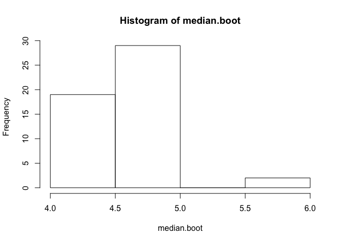

It would be fairly simple to generalize the function to work for any summary statistic, although there often are packages and programs that can do this for you.

<br>

------------------------------------------------------------------------

Using built-in bootstrapping functions
--------------------------------------

R has numerous built in bootstrapping functions, many of which are found in the **boot** package.

### Exercise 2: Cats vs. Dogs using the function **boot()**

Bootstrap the ratio of means using the Cats.csv file, containing brain and body weights for a sample of cats. We might be interested in the ratio of brain to body weight, but prior experience has informed us that ratios and proportions are not necessarily normally distributed data, so we want to use a bootstrap estimation procedure to examine the data. Someone has also informed you that the average ratio of body mass to brain mass in dogs is 208, and being a cat lover you want to ascertain a confidence limit to the ratio and potentially compare whether the mean value for dogs lies within that range.

Make sure the boot package is installed using install.packages("boot"), if necessary:

``` r
library(boot)
d<-read.csv("Cats.csv")
str(d)
```

    ## 'data.frame':    137 obs. of  2 variables:
    ##  $ BrainMass.kg: num  0.024 0.02 0.02 0.02 0.022 0.021 0.022 0.021 0.023 0.024 ...
    ##  $ BodyMass.kg : num  2.86 2.95 2.95 3.18 3.23 ...

``` r
brainratio<-(d$BodyMass.kg/d$BrainMass.kg)
mean(brainratio)
```

    ## [1] 176.065

``` r
hist(brainratio, breaks=30)
```

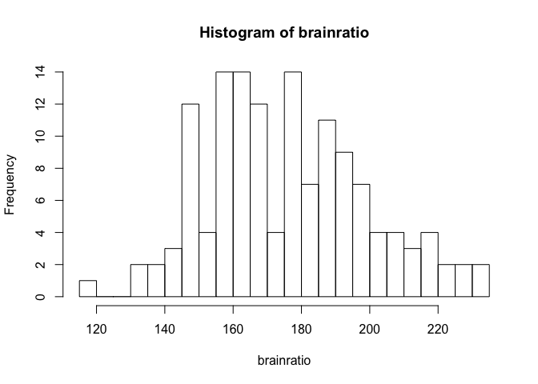

First define the ratio function, which takes the two column variables to calculate the ratio of means, but allows for a weights variable, w:

``` r
ratio <- function(d, w) sum(d[,2] * w)/sum(d[,1] * w)
```

Then use the **boot()** function, specifying the data=d, the statistic=ratio (this is what will be bootstrapped using the new ratio function, R=999 bootstrap replicates, and stype="w" to allow weights to be used in the ratio calculation. By default, the weights will be identical and cancel out, so do not need to be specified.

You can then use the **boot.ci()** function on the bootstrapped variables to estimate non-parametric confidence limits for the statistic of interest.

``` r
bootratio<-boot(data=d, statistic=ratio, R=999, stype="w")
bootratio
```

    ## 
    ## ORDINARY NONPARAMETRIC BOOTSTRAP
    ## 
    ## 
    ## Call:
    ## boot(data = d, statistic = ratio, R = 999, stype = "w")
    ## 
    ## 
    ## Bootstrap Statistics :
    ##     original      bias    std. error
    ## t1* 175.6881 -0.03001476    1.902984

``` r
hist(bootratio$t)
```

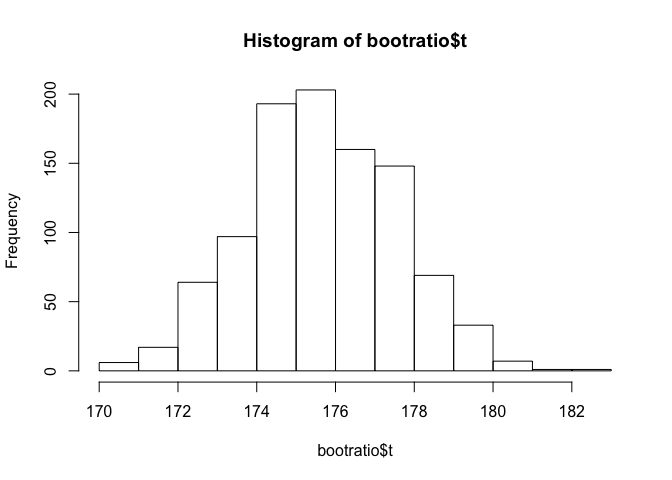

``` r
boot.ci(bootratio, conf=0.95, type = c("all"))
```

    ## Warning in boot.ci(bootratio, conf = 0.95, type = c("all")): bootstrap
    ## variances needed for studentized intervals

    ## BOOTSTRAP CONFIDENCE INTERVAL CALCULATIONS
    ## Based on 999 bootstrap replicates
    ## 
    ## CALL : 
    ## boot.ci(boot.out = bootratio, conf = 0.95, type = c("all"))
    ## 
    ## Intervals : 
    ## Level      Normal              Basic         
    ## 95%   (172.0, 179.4 )   (172.1, 179.3 )  
    ## 
    ## Level     Percentile            BCa          
    ## 95%   (172.0, 179.3 )   (172.2, 179.6 )  
    ## Calculations and Intervals on Original Scale

------------------------------------------------------------------------

Exercise 3: Bootstrap Hypothesis Test - Speed of Light
------------------------------------------------------

Bootstrapping is also used to formally compare data, substituting for parametric statistics that impose assumptions of the data and the population.

The following example is a simple one and commonly used to illustrate bootstrapping.

In 1882 Simon Newcomb performed an experiment to measure the speed of light. The numbers below represent the measured time it took for light to travel from Fort Myer on the west bank of the Potomac River to a fixed mirror at the foot of the Washington monument 3721 meters away.

28 -44 29 30 26 27 22 23 33 16 24 40 21 31 34 -2 25 19

In the units in which the data are given, the currently accepted “true” speed of light is 33.02. (To convert these units to time in the millionths of a second, multiply by 10e-3 and add 24.8.)

``` r
speed <- c(28, -44, 29, 30, 26, 27, 22, 23, 33, 16, 24, 29, 24,
           40 , 21, 31, 34, -2, 25, 19)
realspeed<-speed*10e-3+24.8
hist(realspeed)
```

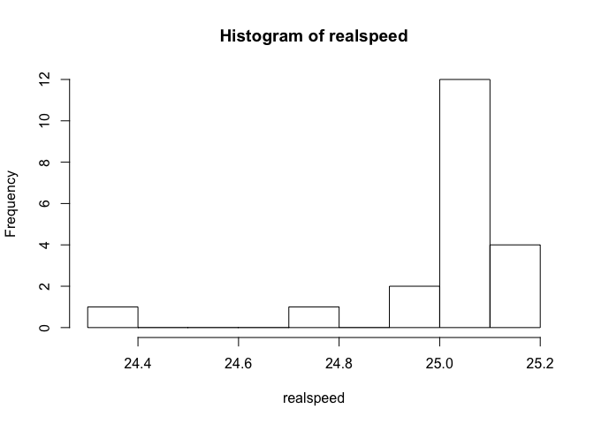

Do the data support the current accepted speed of 33.02?

First, note that the data are not normal, so one cannot perform a t-test:

``` r
qqnorm(speed)
qqline(speed)
```

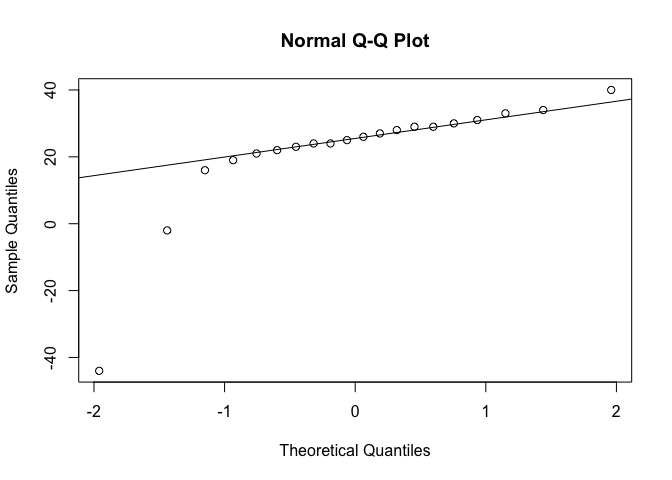

To do the t-test we must assume the population of measurements is normally distributed. If this is not true, at best our tests will be approximations. But with this small sample size, and with such a severe departure from normality, we can’t be guraranteed a good approximation.

The bootstrap offers one approach.

-   Step 1: State null and alternative hypotheses:

    *H*<sub>0</sub> : *m**e**a**n* = 33.02

    *H*<sub>*a*</sub> : *m**e**a**n* &lt; &gt;33.02

-   Step 2: Set the significance level. We’ll choose 5%.
-   Step 3: Choose a test statistic. We wish to estimate the mean speed, and therefore we’ll use the sample average.
-   Step 4: Find the observed value of the test statistic: mean(speed)

We now need the p-value, but to do this we need to know the sampling distribution of our test statistic when the null hypothesis is true. We know it is approximately normal, but also that the approximation might not be very good here.

So our approach instead is to perform a simulation under conditions in which we know the null hypothesis is true.

What we’ll do is use our data to represent the population, but first we shift it over so that the mean really is 33.02, but retains the same variance:

``` r
newspeed <- speed - mean(speed) + 33.02
mean(newspeed)
```

    ## [1] 33.02

``` r
hist(newspeed)
```

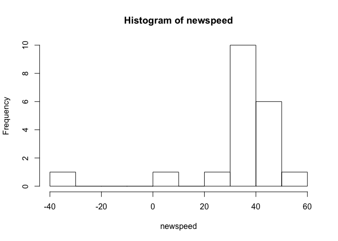

The histogram of newspeed will have exactly the same shape as speed, but it will be shifted over so that it is centered at 33.02 rather than at 21.75.

Now we reach into our fake population and take out 20 observations at random, with replacement. (We take out 20 because that’s the size of our initial sample). We calculate the average. It will be close to 33.02, because that is the mean of the population. We’ll save it, and then repeat this process again. After many repetitions, we’ll have a good idea of what sort of sample averages we should expect when the true mean is 33.02. We will then compare these to our observed sample average (21.75) to see if it’s consistent with our simulated averages. If so, then perhaps the mean really is 33.02. If not, then perhaps Newcomb had some flaws in his experimental design and was measuring incorrectly.

Here’s some code that takes 1000 samples of the data (each of size=20), calculates the mean and stores it:

``` r
set.seed(1234)
bstrap <- c()
for (i in 1:1000){
   newsample <- sample(newspeed, 20, replace=T)
   bstrap <- c(bstrap, mean(newsample))
   }
hist(bstrap, breaks=100)
```

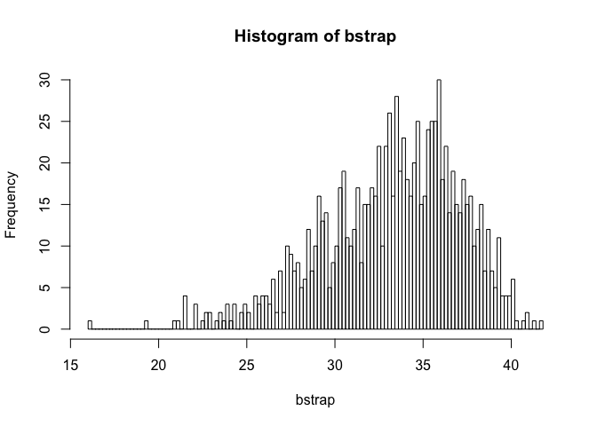

This distribution doesn’t look normal, which means that we did the right thing (i.e. the bootstrap resembles the shape of the data). With a larger sample size it would have looked normal (due to the Central Limit Theorem - the distribution of the means of a sample tends to resemble a normal distribution), but 20 apparently isn’t large enough. We can’t, therefore, trust the normal approximation, and our bootstrap approach will be stronger.

As you can see, it’s not impossible for the sample average to be 21.75 even when the true mean is 33.02, since 21.75 is found within the bootstrap distribution. But it’s not all that common, either.

The p-value is the probability of getting something more extreme than what we observed. 33.02 - 21.75 = 11.27 units away from the null hypothesis. So our p-value is the probability of being more than 11.27 units away from 33.02. Remember Ha was phrased as &lt;&gt; 33.02, so we need to account for both tails:

This is P(Test Stat &lt; 21.75) + P(Test Stat &gt; 44.29). We don’t know the sampling distribution of our test statistic, but our bootstrap sample lets us estimate this probability by summing up a Boolean test of which values fall outside those ranges, and dividing by the size of the bootstrap:

``` r
(sum(bstrap < 21.75) + sum(bstrap > 44.29))/1000
```

    ## [1] 0.008

Therefore, we estimate the p-value to be 0.008. (In other words, in 8 times out of 1000, we had a sample average this extreme.)

Because our significance level is 5% and .8% &lt; 5%, we reject the null hypothesis and conclude that Newcomb’s measurements were not consistent with the currently accepted figure.

Note that there were two extreme observations: -44 and -2. The t-test, because it depends on the sample average, is notoriously susceptible to being influenced by extreme observations. Let’s take those values out and see what happens:

``` r
betterspeed <- speed[-c(2,18)]
betterspeed
```

    ##  [1] 28 29 30 26 27 22 23 33 16 24 29 24 40 21 31 34 25 19

``` r
mean(betterspeed)
```

    ## [1] 26.72222

``` r
qqnorm(betterspeed)
qqline(betterspeed)
```

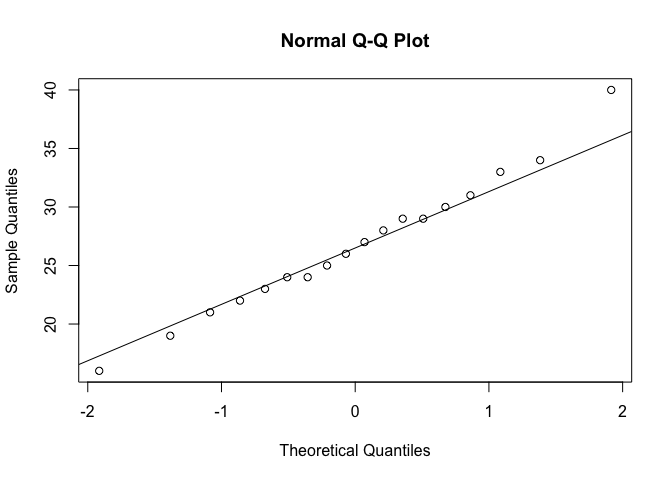

Note that things look much more normal. We can still do our bootstrap test:

``` r
set.seed(1234)
newspeed <- betterspeed - mean(betterspeed) + 33.02
mean(betterspeed)
```

    ## [1] 26.72222

``` r
bstrap <- c()
for (i in 1:10000){
  bstrap <- c(bstrap, mean(sample(newspeed, 18, replace=T)))
}
```

Now you’ll see that the observed value of our test statistic is 26.7222 (the mean of betterspeed above).

Our pvalue is now the probability of seeing something more than (33.02 - 26.722) = 6.298 units away from 33.02. We calculate this as:

``` r
(sum(bstrap < 26.722) + sum(bstrap > 39.218))/10000
```

    ## [1] 0

It’s so extreme, that in 1000 repetitions, we never see numbers that extreme. What if we used the t-test? Since the data now look normal, there’s no reason not to.

``` r
t.test(betterspeed, alternative="two.sided", mu=33.02)
```

    ## 
    ##  One Sample t-test
    ## 
    ## data:  betterspeed
    ## t = -4.6078, df = 17, p-value = 0.0002508
    ## alternative hypothesis: true mean is not equal to 33.02
    ## 95 percent confidence interval:
    ##  23.83863 29.60582
    ## sample estimates:
    ## mean of x 
    ##  26.72222

The p value from the t-test is very low (p = 3e-4 = 0.0003), so you would still conclude that Newcomb's measurements were below the present day, accepted value of 33.02.

The bootstrap approach did not require removing data, whereas performing the t-test required assumptions of normality, which led to us removing those potential outlier data points.

------------------------------------------------------------------------

Exercise 4: Hypothesis testing using simulation
-----------------------------------------------

A class of 315 students was asked to think of any two-digit number and write it down (secretly). The numbers were collected and analysed for whether they occurred at random or not.

Since there are 90 different possible two-digit numbers, but only 315 students, we are bound to have under-representation of certain numbers. Normal contingency table analysis would require at least 5 observations per cell, but 315/90 = 3.5, which suggests that a completely random process would only demonstrate ~3-4 observations per two digit bumber.

We can use hypothesis testing using simulation to determine whether all two-digit numbers occur with equal probability when people choose two-digit numbers haphazardly.

First read and examine data. Each row is the two-digit number chosen by a different individual.

``` r
d<-read.csv("haphazard.csv")
str(d)
```

    ## 'data.frame':    315 obs. of  1 variable:
    ##  $ numberSelected: int  10 10 10 10 10 11 11 11 11 11 ...

Plot the frequency distribution of two-digit numbers chosen by volunteers.

``` r
hist(d$numberSelected, right = FALSE, breaks = seq(10,100, by = 1), 
    las = 1, col = "firebrick", xlab = "Number thought of by volunteer", 
    ylim=c(0,50), xlim=c(0,100))
```

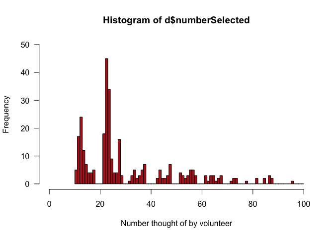 Frequency table of the two-digit numbers chosen by volunteers. Notice that many numbers between 10 and 99 are not represented in the data. To make sure that numbers not chosen are nevertheless included in the calculations, we must convert the variable to a factor and specify all possible categories.

``` r
table(d$numberSelected)
```

    ## 
    ## 10 11 12 13 14 15 16 17 21 22 23 24 25 26 27 28 31 32 33 34 35 36 37 42 43 
    ##  5 17 24 12  7  4  4  5 18 45 34  9  4  4 16  3  1  3  5  2  3  5  7  2  5 
    ## 44 45 46 47 51 52 53 54 55 56 57 61 62 63 64 65 66 67 71 72 73 77 81 84 86 
    ##  2  2  3  7  4  3  2  3  5  5  3  3  1  3  3  1  2  3  1  2  2  1  2  2  3 
    ## 87 95 
    ##  2  1

``` r
factorData <- factor(d$numberSelected, levels = 10:99)
observedFreq <- table(factorData)
observedFreq
```

    ## factorData
    ## 10 11 12 13 14 15 16 17 18 19 20 21 22 23 24 25 26 27 28 29 30 31 32 33 34 
    ##  5 17 24 12  7  4  4  5  0  0  0 18 45 34  9  4  4 16  3  0  0  1  3  5  2 
    ## 35 36 37 38 39 40 41 42 43 44 45 46 47 48 49 50 51 52 53 54 55 56 57 58 59 
    ##  3  5  7  0  0  0  0  2  5  2  2  3  7  0  0  0  4  3  2  3  5  5  3  0  0 
    ## 60 61 62 63 64 65 66 67 68 69 70 71 72 73 74 75 76 77 78 79 80 81 82 83 84 
    ##  0  3  1  3  3  1  2  3  0  0  0  1  2  2  0  0  0  1  0  0  0  2  0  0  2 
    ## 85 86 87 88 89 90 91 92 93 94 95 96 97 98 99 
    ##  0  3  2  0  0  0  0  0  0  0  1  0  0  0  0

``` r
plot(observedFreq)
```

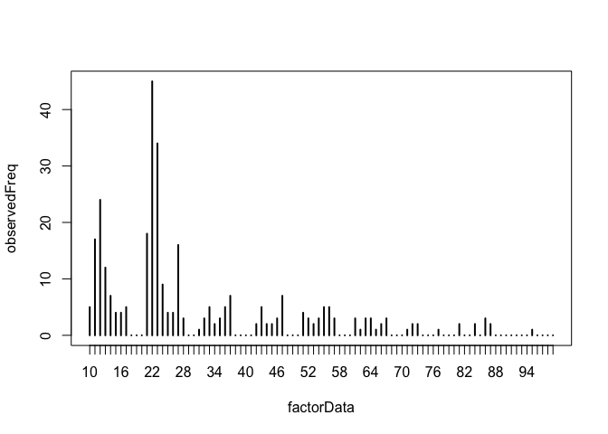

Now, calculate the observed value of the test statistic. Here, we are using the *χ*<sup>2</sup> goodness-of-fit statistic. We are lazy and use the chisq.test function to do the calculations. R will give you a warning because of the low expected frequencies. This is exactly why we need to use simulation instead of the *χ*<sup>2</sup> goodness-of-fit-test.

``` r
chiData <- chisq.test(observedFreq)$statistic
```

    ## Warning in chisq.test(observedFreq): Chi-squared approximation may be
    ## incorrect

``` r
chiData
```

    ## X-squared 
    ##      1231

We'll need to know the sample size (number of rows, in this case) to run the simulation.

``` r
n <- nrow(d)
n
```

    ## [1] 315

Simulate a single random sample of n numbers from 10 to 99 (with replacement), where n is the number of individuals in the sample.

``` r
randomTwoDigit <- sample(10:99, size = n, replace = TRUE)
randomTwoDigit
```

    ##   [1] 24 82 78 38 47 54 26 18 30 23 58 20 86 47 67 76 41 10 83 39 64 63 24
    ##  [24] 48 18 98 10 49 83 40 78 43 70 73 73 92 48 30 21 28 55 40 44 21 23 74
    ##  [47] 27 66 68 44 65 67 86 40 84 95 42 60 92 70 58 93 57 19 26 47 29 95 81
    ##  [70] 34 93 88 44 84 34 79 69 51 24 41 27 56 29 70 60 51 70 78 57 30 30 35
    ##  [93] 59 79 65 61 75 75 41 51 38 89 48 49 84 55 44 95 30 84 22 81 33 84 20
    ## [116] 74 77 12 78 83 25 33 43 89 62 71 99 99 99 71 49 88 88 46 17 61 51 52
    ## [139] 32 37 18 50 97 18 40 21 45 10 91 41 39 65 77 78 79 13 20 65 40 83 47
    ## [162] 80 37 15 65 46 93 73 24 90 80 15 66 58 98 61 73 51 99 90 46 77 50 16
    ## [185] 15 70 95 72 46 79 41 19 95 65 46 35 22 62 58 98 53 50 95 17 67 20 18
    ## [208] 33 33 51 99 80 14 37 23 80 76 11 31 65 10 66 62 24 92 92 28 72 76 73
    ## [231] 44 66 13 66 69 51 49 54 31 30 33 92 51 42 60 42 93 48 42 27 65 45 17
    ## [254] 35 73 42 47 31 17 55 21 26 75 59 51 25 61 87 89 61 29 82 61 67 18 22
    ## [277] 59 21 82 69 55 99 52 24 13 66 26 77 89 40 34 16 57 61 69 19 74 31 61
    ## [300] 48 18 92 13 91 19 22 81 63 19 43 99 70 51 53 75

``` r
hist(randomTwoDigit, breaks=20, xlim=c(0,100))
```

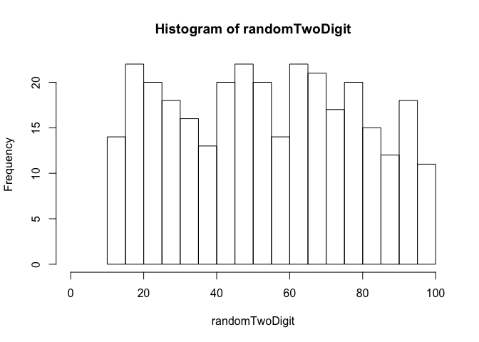

Calculate the test statistic for this single simulated sample *χ*<sup>2</sup>. Remember to convert to a factor to make sure that all categories are included in the calculations. Under the null hypothesis, the expected frequency is the same for all numbers.

``` r
randomTwoDigit <- factor(randomTwoDigit, levels = 10:99)
observedFreq <- table(randomTwoDigit)
expectedFreq <- n/length(10:99)
chiSim <- sum( (observedFreq - expectedFreq)^2 / expectedFreq )
chiSim
```

    ## [1] 94.42857

Or use the chisq.test function:

``` r
chisq.test(observedFreq)$statistic
```

    ## Warning in chisq.test(observedFreq): Chi-squared approximation may be
    ## incorrect

    ## X-squared 
    ##  94.42857

Repeat this process many times to obtain the distribution for your test statistic. The following is a loop repeated nSim times. In each iteration i, a random sample of numbers is simulated, a frequency table is calculated, and the *χ*<sup>2</sup> statistic is computed. The statistic is saved in the ith element of the vector results.

``` r
nSim <- 10000
results <- c()
for(i in 1:nSim){
    randomTwoDigit <- sample(10:99, size = n, replace = TRUE)
    randomTwoDigit <- factor(randomTwoDigit, levels = 10:99)
    simFreq <- table(randomTwoDigit)
    expectedFreq <- n/length(10:99)
    results[i] <- sum( (simFreq - expectedFreq)^2 / expectedFreq )
    }
```

Plot the frequency distribution of *χ*<sup>2</sup> values from the simulation. This is the simulated null distribution for the test statistic.

``` r
hist(results, right = FALSE, breaks = 500)
```

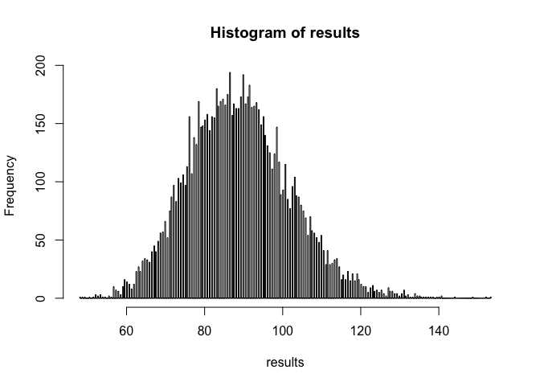

The p-value is the fraction of similated chisquare values equalling or exceededing the observed value of the test statistic performed on the original data.

``` r
P <- sum(results >= chiData)/nSim
P
```

    ## [1] 0

Even with 10000 simulations, none of them produce a *χ*<sup>2</sup> statistic as large as the observed one. Thus, the p-value is &lt;1/10000 or &lt;1e-4.

R also has a built-in method to simulate the null distribution and calculate the P-value. Using it simply involves providing a couple of arguments to the chisq.test function. B is the number of iterations desired. If you don't provide the probabilities of each outcome under the null hypothesis as an argument, R assumes that all the categories are equiprobable under the nuill hypothesis.

``` r
factorData <- factor(d$numberSelected, levels = 10:99)
observedFreq <- table(factorData)
chisq.test(observedFreq, simulate.p.value = TRUE, B = 10000)
```

    ## 
    ##  Chi-squared test for given probabilities with simulated p-value
    ##  (based on 10000 replicates)
    ## 
    ## data:  observedFreq
    ## X-squared = 1231, df = NA, p-value = 9.999e-05

<br>

------------------------------------------------------------------------

Exercise 5 : Chimp language centers
-----------------------------------

Obtain a bootstrap estimate of the median asymmetry score for Brodmann’s area 44 in chimpanzees.

Read and examine the data.

``` r
chimp <- read.csv("chimp.csv")
head(chimp)
```

    ##    chimpName sex asymmetryScore
    ## 1     Austin   M           0.30
    ## 2 Carmichael   M           0.16
    ## 3      Chuck   M          -0.24
    ## 4      Dobbs   M          -0.25
    ## 5     Donald   M           0.36
    ## 6      Hoboh   M           0.17

Histogram of asymmetry scores of the 20 chimps.

``` r
hist(chimp$asymmetryScore, breaks = seq(-.5, 1.25, by = 0.25), 
    right = FALSE, col = "firebrick", las = 1)
```

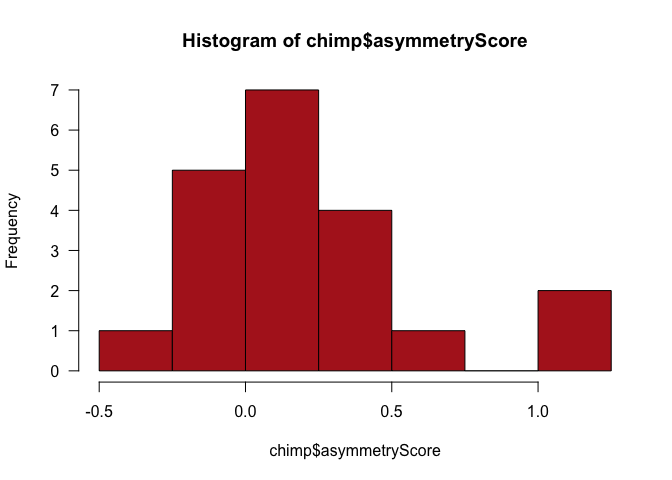

Estimate the median asymmetry score from the data.

``` r
median(chimp$asymmetryScore)
```

    ## [1] 0.14

Obtain a single bootstrap replicate. This involves sampling (with replacement) from the actual data. Calculate the median of this bootstrap replicate.

``` r
bootSample <- sample(chimp$asymmetryScore, size = nrow(chimp), replace = TRUE)
median(bootSample)
```

    ## [1] 0.32

Repeat this process many times. The following is a loop repeated B times. In each iteration, the bootstrap replicate estimate (median) is recalculated and saved in the results vector bootMedian.

``` r
B <- 10000
bootMedian <- vector()
for(i in 1:B){
    bootSample <- sample(chimp$asymmetryScore, size = nrow(chimp), replace = TRUE)
    bootMedian[i] <- median(bootSample)
    }
```

Draw a histogram of the bootstrap replicate estimates for median asymmetry. Note: your results won't be the identical to the one here, because 10,000 random samples is not large enough to obtain the sampling distribution with extreme accuracy. Increase B in the above loop for greater accuracy.

``` r
hist(bootMedian, breaks = 100, right = FALSE, col = "firebrick", las = 1)
```


Calculate the mean of the bootstrap replicate estimates.

``` r
mean(bootMedian)
```

    ## [1] 0.14186

The bootstrap standard error is the standard deviation of the bootstrap replicate estimates.

``` r
sd(bootMedian)
```

    ## [1] 0.08784681

Use the percentiles of the bootstrap replicate estimates to obtain a bootstrap 95% confidence interval for the population median.

``` r
quantile(bootMedian, probs = c(0.025, 0.975))
```

    ##   2.5%  97.5% 
    ## -0.075  0.310

Use the boot package for bootstrap estimation.

``` r
library(boot)
```

To begin, we need to define a new R function to tell the boot package what statistic we want to estimate, which is the median in this example. Let's call the new function boot.median. The syntax required by the package is not too complex, but our function must include a counter as an argument (as usual, we call it i).

``` r
boot.median <- function(x, i){median(x[i])}
```

Use the boot function of the boot package to obtain many bootstrap replicate estimates and calculate the bootstrap standard error.

``` r
bootResults <- boot(chimp$asymmetryScore, boot.median, R = 10000)
bootResults
```

    ## 
    ## ORDINARY NONPARAMETRIC BOOTSTRAP
    ## 
    ## 
    ## Call:
    ## boot(data = chimp$asymmetryScore, statistic = boot.median, R = 10000)
    ## 
    ## 
    ## Bootstrap Statistics :
    ##     original   bias    std. error
    ## t1*     0.14 0.000805   0.0871543

Draw a histogram of the bootstrap replicate estimates for median asymmetry.

``` r
hist(bootResults$t, breaks = 100, right = FALSE, col = "firebrick", las = 1)
```

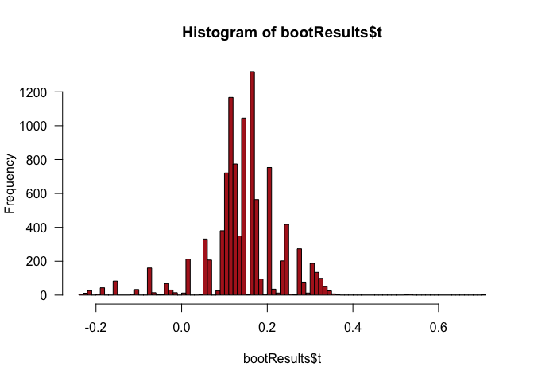

Get the bootstrap 95% confidence interval for the population median. We show two methods. The percentile method is already familiar, but boot also provides an improved method, called "bias corrected and accelerated".

``` r
boot.ci(bootResults, type = "perc")
```

    ## BOOTSTRAP CONFIDENCE INTERVAL CALCULATIONS
    ## Based on 10000 bootstrap replicates
    ## 
    ## CALL : 
    ## boot.ci(boot.out = bootResults, type = "perc")
    ## 
    ## Intervals : 
    ## Level     Percentile     
    ## 95%   (-0.075,  0.310 )  
    ## Calculations and Intervals on Original Scale

``` r
boot.ci(bootResults, type = "bca")
```

    ## BOOTSTRAP CONFIDENCE INTERVAL CALCULATIONS
    ## Based on 10000 bootstrap replicates
    ## 
    ## CALL : 
    ## boot.ci(boot.out = bootResults, type = "bca")
    ## 
    ## Intervals : 
    ## Level       BCa          
    ## 95%   (-0.16,  0.30 )  
    ## Calculations and Intervals on Original Scale

Exercise 6: Sexual cannibalism in crickets
------------------------------------------

Bootstrap estimation of the difference between medians of two groups, using times to mating (in hours) of female sagebrush crickets that were either starved or fed.

Use the boot package in R to address this dataset.

First, read and inspect the data.

``` r
d<-read.csv("cannibalism.csv")
str(d)
```

    ## 'data.frame':    24 obs. of  2 variables:
    ##  $ feedingStatus: Factor w/ 2 levels "fed","starved": 2 2 2 2 2 2 2 2 2 2 ...
    ##  $ timeToMating : num  1.9 2.1 3.8 9 9.6 13 14.7 17.9 21.7 29 ...

``` r
boxplot(timeToMating~feedingStatus, data=d)
```

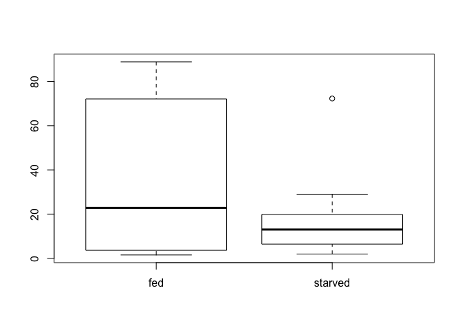

Calculate the observed difference between the sample medians of the two groups.

``` r
twoMedians <- tapply(d$timeToMating, d$feedingStatus, median)
diffMedian <- twoMedians[2] -  twoMedians[1]
diffMedian
```

    ## starved 
    ##    -9.8

Define a new function to calculate the difference between the medians of the bootstrap replicate estimates. Let's call it boot.diffMedian.

``` r
boot.diffMedian <- function(x, i){
    twoMedians <- tapply(x$timeToMating[i], x$feedingStatus[i], median)
    diffMedian <- twoMedians[2] -  twoMedians[1]
    }
```

Load the boot package, obtain the many bootstrap replicate estimates and get the bootstrap standard error.

``` r
library(boot)
bootResults <- boot(d, boot.diffMedian, R = 10000)
mean(bootResults$t)
```

    ## [1] -17.0767

``` r
bootResults
```

    ## 
    ## ORDINARY NONPARAMETRIC BOOTSTRAP
    ## 
    ## 
    ## Call:
    ## boot(data = d, statistic = boot.diffMedian, R = 10000)
    ## 
    ## 
    ## Bootstrap Statistics :
    ##     original  bias    std. error
    ## t1*     -9.8 -7.2767    19.38015

Histogram of the bootstrap replicate estimates of the difference between two medians:

``` r
hist(bootResults$t, breaks = 20, right = FALSE, col = "firebrick", las = 1)
```

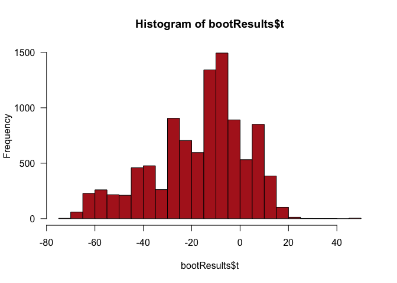

Obtain the bootstrap 95% confidence interval for the difference between the population medians, using the percentile and the "bca" method.

``` r
boot.ci(bootResults, type = "perc")
```

    ## BOOTSTRAP CONFIDENCE INTERVAL CALCULATIONS
    ## Based on 10000 bootstrap replicates
    ## 
    ## CALL : 
    ## boot.ci(boot.out = bootResults, type = "perc")
    ## 
    ## Intervals : 
    ## Level     Percentile     
    ## 95%   (-61.1,  12.2 )  
    ## Calculations and Intervals on Original Scale

``` r
boot.ci(bootResults, type = "bca")
```

    ## BOOTSTRAP CONFIDENCE INTERVAL CALCULATIONS
    ## Based on 10000 bootstrap replicates
    ## 
    ## CALL : 
    ## boot.ci(boot.out = bootResults, type = "bca")
    ## 
    ## Intervals : 
    ## Level       BCa          
    ## 95%   (-55.7,  15.5 )  
    ## Calculations and Intervals on Original Scale

Examples and explanations were derived from the following sources:
------------------------------------------------------------------

Whitlock and Schluter

<https://stats.idre.ucla.edu/r/library/r-library-introduction-to-bootstrapping/>
